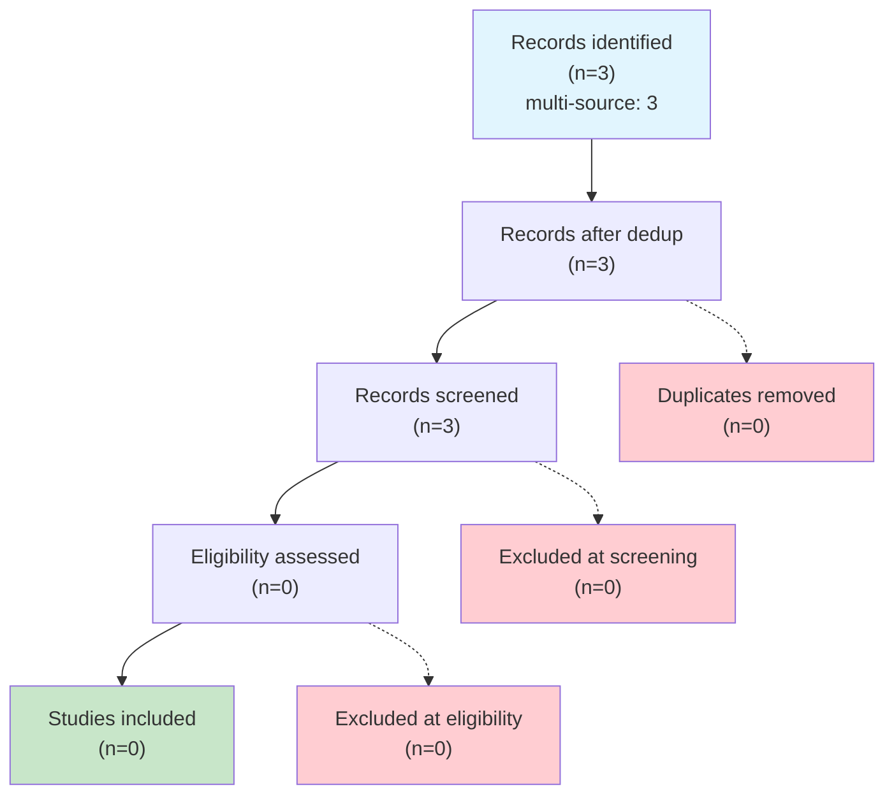

```mermaid
graph TD
    ID["Records identified<br/>(n=3)<br/>multi-source: 3"]
    DD["Records after dedup<br/>(n=3)"]
    SC["Records screened<br/>(n=3)"]
    EL["Eligibility assessed<br/>(n=0)"]
    IN["Studies included<br/>(n=0)"]

    EX_DD["Duplicates removed<br/>(n=0)"]
    EX_SC["Excluded at screening<br/>(n=0)"]
    EX_EL["Excluded at eligibility<br/>(n=0)"]

    ID --> DD
    DD --> SC
    SC --> EL
    EL --> IN

    DD -.-> EX_DD
    SC -.-> EX_SC
    EL -.-> EX_EL

    style ID fill:#e1f5fe
    style IN fill:#c8e6c9
    style EX_DD fill:#ffcdd2
    style EX_SC fill:#ffcdd2
    style EX_EL fill:#ffcdd2
```
